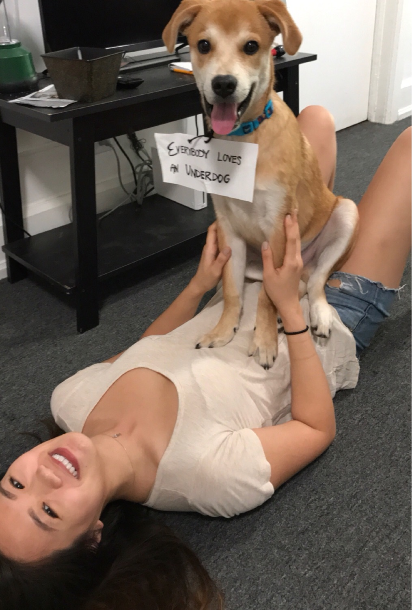
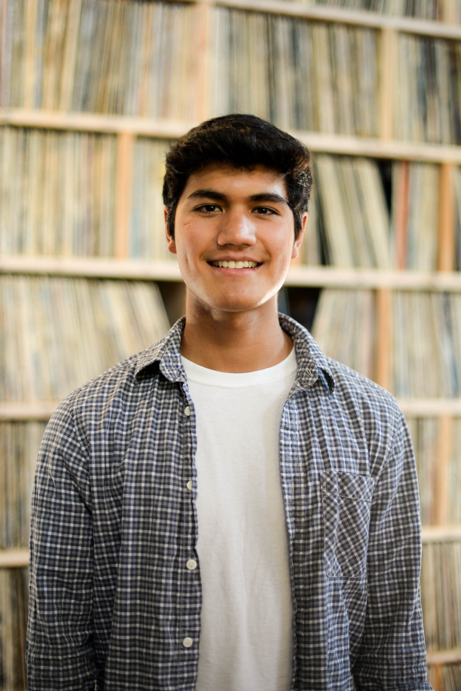
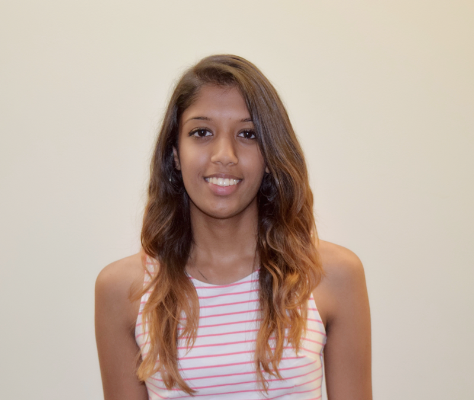

# ECE 3400 Team 1
Cornell University, Fall 2017

 <a href="http://blingee.com/pictures/hello-kitty-background-blingee" target="_blank" title="hello kitty background blingee pictures">hello kitty background blingee pictures</a>  

## Labs

[Lab 1](./lab1.md) 

[Lab 2](./lab2.md)

[Milestone 1](./milestone1.md)

[Milestone 2](./Milestone2.md)

## Team Logistics

[Team Contract](https://docs.google.com/document/d/11ZBqf6RC5hrOcDreiL2vlYcdcat49vuX1CWatlyPSTk/edit?usp=sharing)

[Minutes](./minutes.md)

## About Us

|Name | netId |Photo|
|-----|-------|-----|
|Evan Kravitz| [esk95     ](mailto:esk95@cornell.edu) | |
|Katherine Lu| [kl645     ](mailto:kl645@cornell.edu) |  |
|Jeffrey Hurd| [jjh353     ](mailto:jjh353@cornell.edu)| |
|Radhika Chinni| [rpc222     ](mailto:rpc222@cornell.edu) |  |
|Frances Koback| [flk26     ](mailto:flk26@cornell.edu)|  |
|Michael Solomentsev| [mys29     ](mailto:mys29@cornell.edu) |  |

