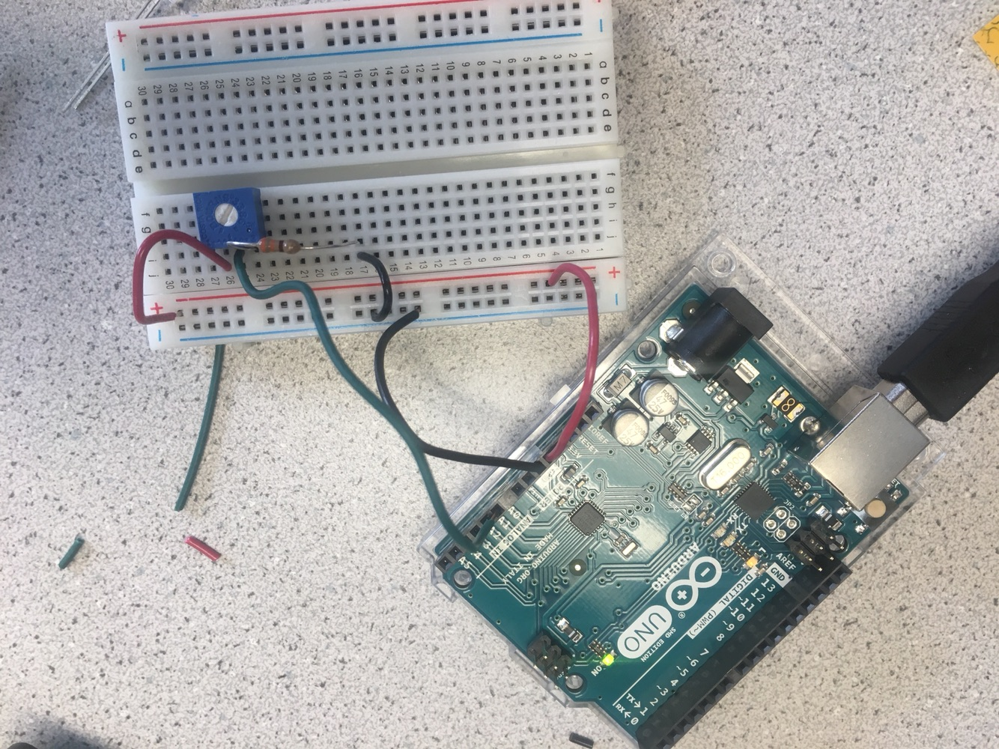
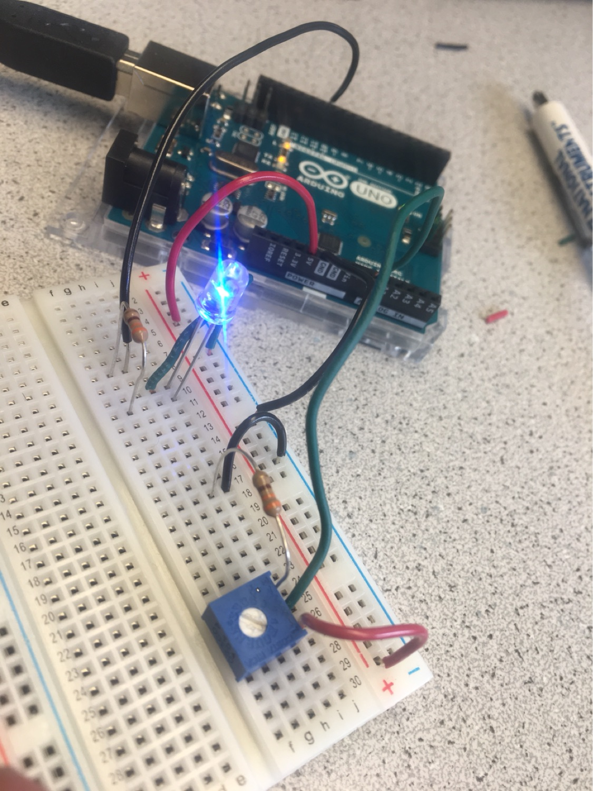

# Lab 1

## Part 1: Modying the Blink Sketch

For this part of the lab, we made simple modifications to the preexisting code in order to work for an external LED. We declared a global variable `pin` in order to specify the external pin we wish to have blink. 

## Part 2: Outputing Analog Voltages

For the second phase of the lab, we took advantage of the `analogRead` method in order to use the analog voltage values that were being controlled by the potentiometer. Here's our code:

```
int sensorPin = A0;
int voltageValue = 0;
int delayTime = 500;

void setup() {
  Serial.begin(9600);
}

void loop() {
  voltageValue = analogRead(sensorPin);
  Serial.println(voltageValue);
  delay(delayTime);
}
```

Here's a photo of the circuit:


## Part 3: Analog LED Output

The third phase of this lab is very similar to the previous part. We used the `analogWrite` function in order to write analog PWM voltages to the LED. We mapped the input voltage to the output voltage written to the LED using the following mapping scheme. The maximum value (unknown units) for the voltage we were getting was 1023; the minimum value was 6. The maximum allowed input for analogWrite is 255, so we essentially made the analog output vary linearly between 0 and 255 for all allowed analog inputs from the potentiometer. For reference, the code has been included below:

```
int sensorPin = A0;
int outputPin = 11;
float voltageValue = 0;


void setup() {
  pinMode(outputPin, OUTPUT);
  Serial.begin(9600);
}

void loop() {
  voltageValue = analogRead(sensorPin);
  analogWrite(outputPin, 255 * (voltageValue-6)/1017);
  Serial.println(voltageValue);
  //Frequency of PWM is 490.2 Hz
}
```

Here's a photo of the circuit: 


## Part 4: Parallax Servos 

For the final lab component, we actuated the angular velocity of the servos using the votlage read by the Arduino (controlled by series resistor and potentiometer). We utilized a similar mapping scheme as the previous part, except with different scaling to accomodate for the servo `write` function input. The Arduino code has been included below:

```
#include <Servo.h>;
Servo servo;
int outputPin = 11;
int sensorPin = A0;
float voltageValue;

void setup() {
  // put your setup code here, to run once:
  Serial.begin(9600);
  pinMode(outputPin, OUTPUT);
  servo.attach(outputPin);
}

void loop() {
  // put your main code here, to run repeatedly:
  voltageValue = analogRead(sensorPin);
  float servoSpeed = 180 * (voltageValue-1)/989;
  Serial.println(servoSpeed);
  servo.write(servoSpeed);
}

```

Here's a photo of the circuit:


