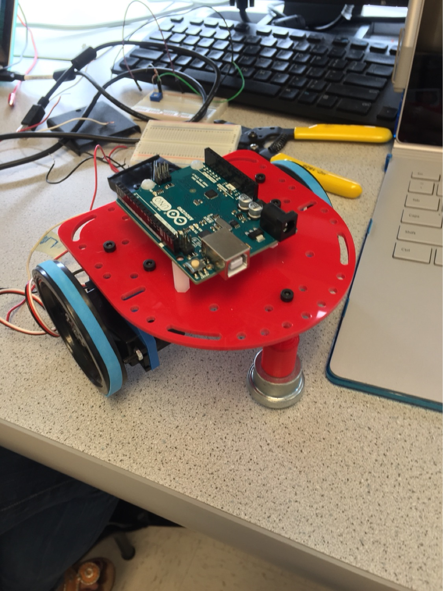
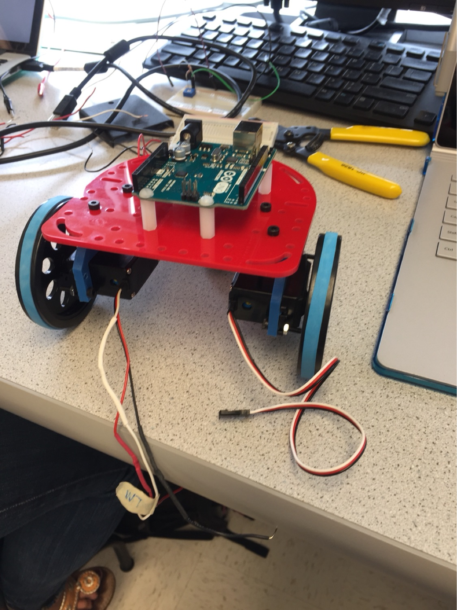

# Lab 1

## Part 1: Modifying the Blink Sketch

For this part of the lab, we made simple modifications to the preexisting code in order to work for an external LED. We declared a global variable `pin` in order to specify the external pin we wish to have blink. 

## Part 2: Outputing Analog Voltages

For the second phase of the lab, we took advantage of the `analogRead` method in order to use the analog voltage values that were being controlled by the potentiometer. Here's our code:

```
int sensorPin = A0;
int voltageValue = 0;
int delayTime = 500;

void setup() {
  Serial.begin(9600);
}

void loop() {
  voltageValue = analogRead(sensorPin);
  Serial.println(voltageValue);
  delay(delayTime);
}
```

Here's a photo of the circuit:


## Part 3: Analog LED Output

The third phase of this lab is very similar to the previous part. We used the `analogWrite` function in order to write analog PWM voltages to the LED. We mapped the input voltage to the output voltage written to the LED using the following mapping scheme. The maximum value (unknown units) for the voltage we were getting was 1023; the minimum value was 6. The maximum allowed input for analogWrite is 255, so we essentially made the analog output vary linearly between 0 and 255 for all allowed analog inputs from the potentiometer. For reference, the code has been included below:

```
int sensorPin = A0;
int outputPin = 11;
float voltageValue = 0;


void setup() {
  pinMode(outputPin, OUTPUT);
  Serial.begin(9600);
}

void loop() {
  voltageValue = analogRead(sensorPin);
  analogWrite(outputPin, 255 * (voltageValue-6)/1017);
  Serial.println(voltageValue);
  //Frequency of PWM is 490.2 Hz
}
```

Here's a photo of the circuit: 


## Part 4: Parallax Servos 

For the final lab component, we actuated the angular velocity of the servos using the voltage read by the Arduino (controlled by series resistor and potentiometer). We utilized a similar mapping scheme as the previous part, except with different scaling to accomodate for the servo `write` function input. The Arduino code has been included below:

```
#include <Servo.h>;
Servo servo;
int outputPin = 11;
int sensorPin = A0;
float voltageValue;

void setup() {
  // put your setup code here, to run once:
  Serial.begin(9600);
  pinMode(outputPin, OUTPUT);
  servo.attach(outputPin);
}

void loop() {
  // put your main code here, to run repeatedly:
  voltageValue = analogRead(sensorPin);
  float servoSpeed = 180 * (voltageValue-1)/989;
  Serial.println(servoSpeed);
  servo.write(servoSpeed);
}

```

Here's a photo of the circuit:


## Progress on Robot:

This week we also began working on the basic functionality of the robot. We used what we learned in Lab 1 to implement robot movement. 

We first built the robot chassis using the 3D-printed and laser-etched parts already sitting in the lab room. We used:

```
- 1 robot base (the large red platform in the image)
- 2 servo mounts
- 2 continuous rotation servos
- 2 wheels
- 2 rubber bands
- 1 Arduino Uno
- 1 battery holder (with 2 AA batteries)
- 1 breadboard
- Various wires, screws, nuts, and spacers
```

The construction of the robot was a fairly simple, but time-consuming process. We modeled our prototype off of the existing robots sitting in the lab room. The Arduino sits on the top of the robot, and the servo mounts (and the accompanying servo-wheel pieces) sit below. See the images for more details. 




Our power setup was somewhat less than ideal. Because the standard 5V battery packs were discharged (and according to the TAs, took a significant amount of time to charge), we relied on a battery holder with 2 AA batteries inside to power our servos. Because the batteries could not sit on the robot, we used a a breadboard to wire up the servo power lines (as well as the servo control lines). We also used the standard Arduino power supply cable to power the Arduino. The wiring was a bit messy, and the breadboard sat apart from the robot. This meant that when we actually made the servos move, we had to be very careful. Cleaning up the wiring (perhaps by using a protoboard) is a priority for us.

Once the robot was set up, we modified the code from Part 4 of the lab to control 2 servos. We programmed the servos to move in the same direction, so the robot spun in a little circle! This occurred because the servos are oriented in opposite directions on the actual robot chassis. The code is below:

...INSERT CODE!!!!
