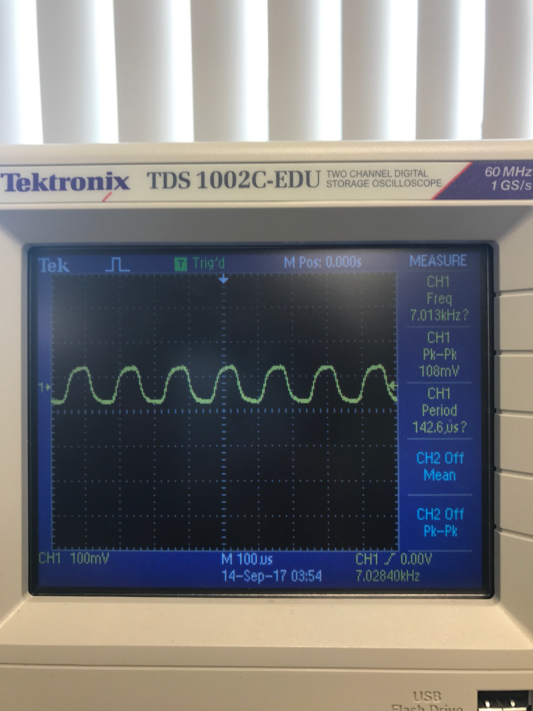
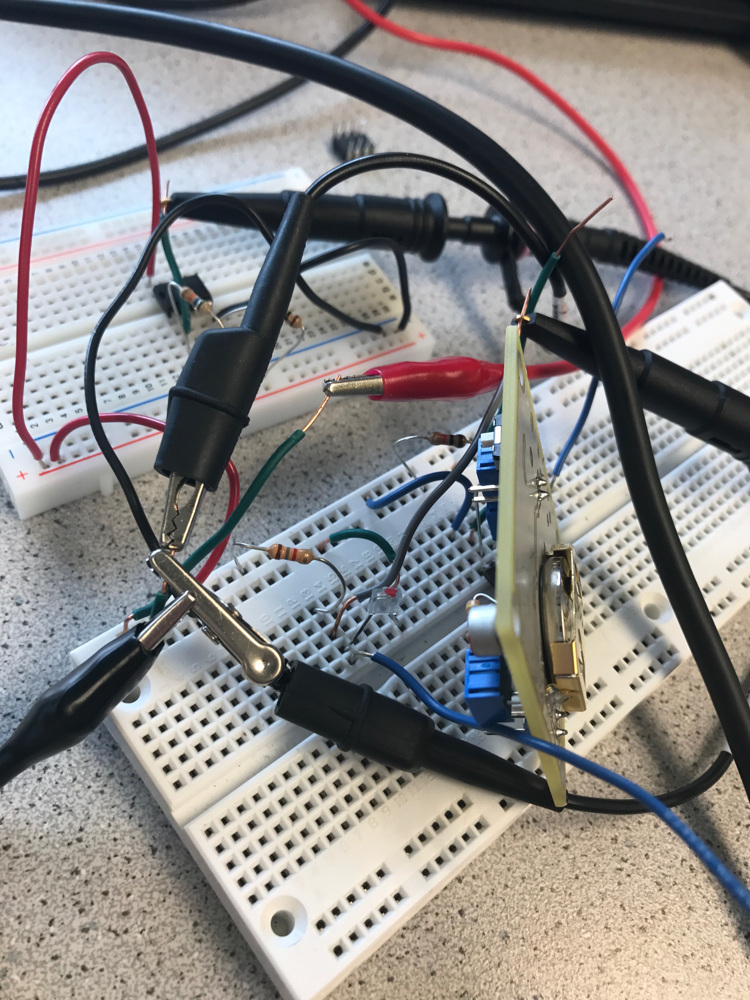
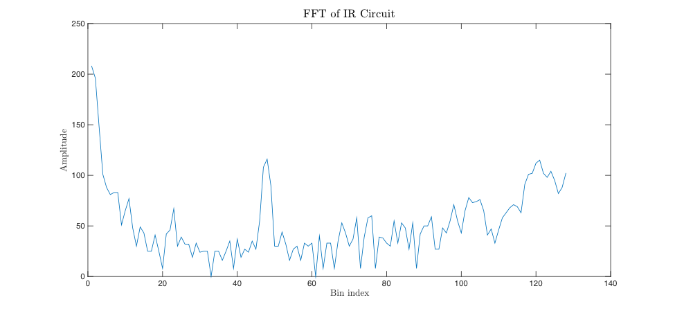

<meta http-equiv="X-UA-Compatible" content="IE=Edge,chrome=1">
# Lab 2

## Optical Team -- IR Circuit

Materials used:

- breadboard
- wires
- phototransistor
- 1.78 kΩ resistor
- Arduino Uno
- USB serial cable
- oscilloscope

For this component of the lab, we constructed a circuit that is able to detect electromagnetic radiation of infrared (IR) frequncy. A photo transistor was used to modulate the circuit in response to a 7 kHz pulsating IR light. The phototransistor works via an embedded bipolar junction transistor, which is able to pass current in response to incident electromagnetic radiation. The changing current causes voltage to drop across the serial resistor. We measured the voltage at the terminal of the resistor with an oscilloscope. The amplitude of the voltage recorded was around 100 mV. This voltage was directly connected to an analog pin of the Arduino Uno with a wire.

Below is a photograph of the oscilloscope depicting the sinusoidal voltage signal generated from the phototransistor. 

We've also included a photo of the circuit:

We then used the standard `fft` library to process the voltage signal. The Arduino has built-in hardware capable of processing the signal using the ADC (analog-to-digital) converter, which performs better than the regular `analogRead` function for high frequency data.

The data was then transformed into the frequency-domain using the `fft` library. FFT--or Fast Fourier Transform--is a method used by computers to efficiently convert time-domain data into the frequency domain. We utilized the `fft_adc_serial` script to output a serial stream of frequency data. The `fft` takes advantage of the analog-to-digital converter. Each serial line of output corresponds to the amplitude of the input signal at a frequency related to the relative index of the line output. Each index corresponds to an integer multiple of the sampling frequency, so index *i* corresponds to frequency *fsi*, where *fs* is the sampling frequency. 

In order to make sense of the FFT data, we needed to figure out the sampling frequency. Using the data sheet, we deduced that the sampling frequency, *fs*, is roughly 150 Hz. 

After gathering the FFT serial data, we plotted the data in MATLAB. Included below is a MATLAB plot we generated from the data:

Since the sampling frequency is 150 Hz, and the pulsating frequency of the IR signal is  7 kHz, we should see high ampilitude around bin index 46. The MATLAB plot clearly shows this feature at around that index value, demonstrating that the Arduino can detect IR signals.

<video width="320" height="200" controls preload> 
    <source src="IMG_0198.mp4"></source> 
</video>
For future developments, we plan to use analog filtering to enhance the quality of the FFT data. In addition, to ensure that low intensity IR radiation can be detected, we plan to incorporate some sort of analog amplifier. We tried to use an op-amp to achieve this task for this lab, but were unable to get the circuit to perform properly. 

