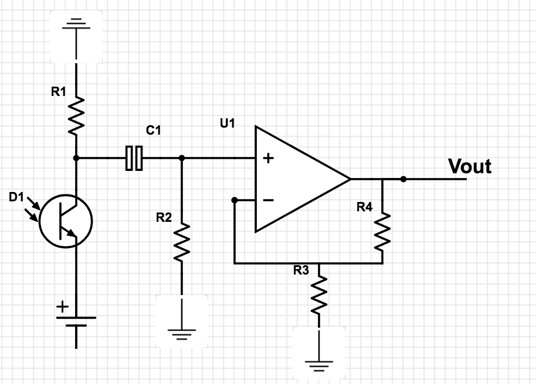
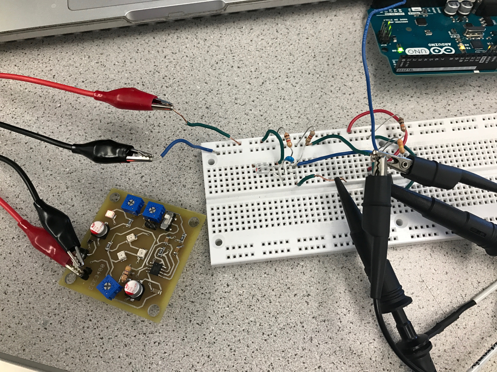
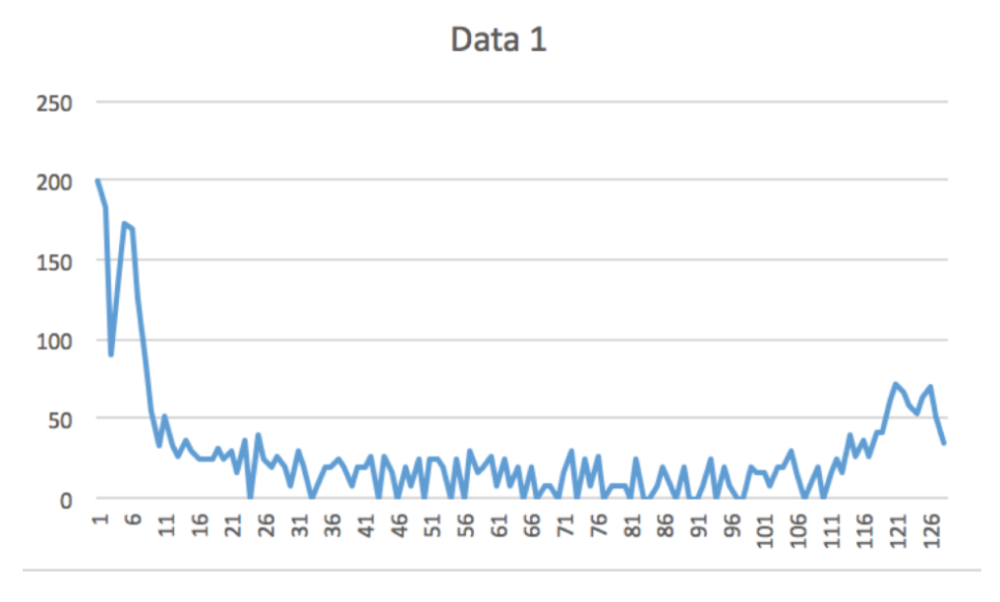
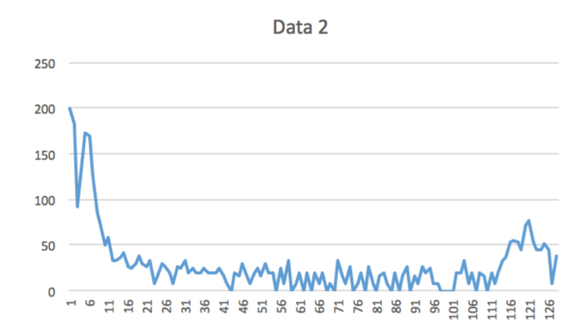
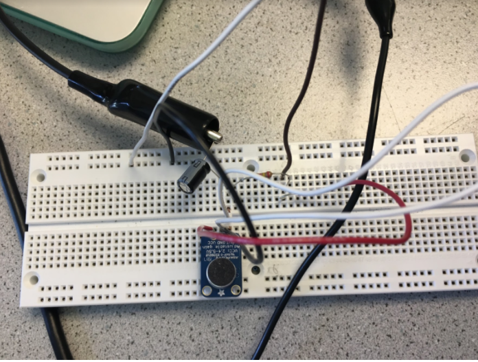
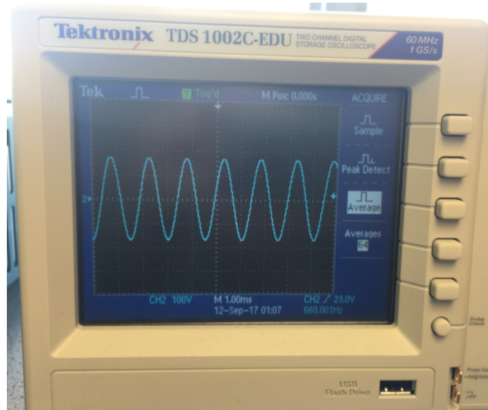
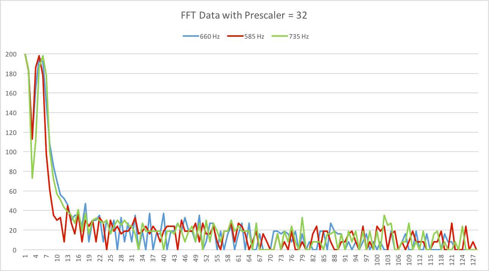
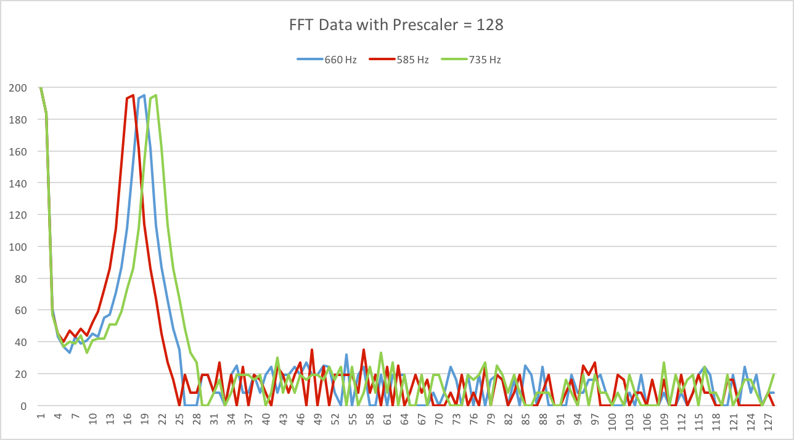
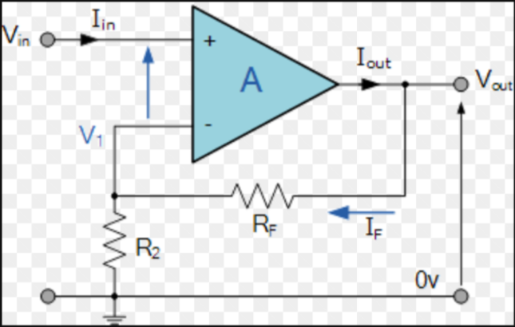

<meta http-equiv="X-UA-Compatible" content="IE=Edge,chrome=1">
# Lab 2

## Optical Team -- IR Circuit

Materials used:

- breadboard
- wires
- phototransistor
- resistors
- capacitor
- Arduino Uno
- USB serial cable
- oscilloscope
- LM358 operational amplifier
- treasure

For this component of the lab, we constructed a circuit that is able to detect electromagnetic radiation of infrared (IR) frequncy. A photo transistor was used to modulate the circuit in response to a 7 kHz pulsating IR light. The phototransistor works via an embedded bipolar junction transistor, which is able to pass current in response to incident electromagnetic radiation. The changing current causes voltage to drop across the serial resistor. We measured the voltage at the terminal of the resistor with an oscilloscope. The amplitude of the voltage recorded was around 100 mV. This voltage was directly connected to an analog pin of the Arduino Uno with a wire.

Below is a photograph of the oscilloscope depicting the sinusoidal voltage signal generated from the phototransistor. 


We've also included a photo of the circuit:


We then used the standard `fft` library to process the voltage signal. The Arduino has built-in hardware capable of processing the signal using the ADC (analog-to-digital) converter, which performs better than the regular `analogRead` function for high frequency data.

The data was then transformed into the frequency-domain using the `fft` library. FFT--or Fast Fourier Transform--is a method used by computers to efficiently convert time-domain data into the frequency domain. We utilized the `fft_adc_serial` script to output a serial stream of frequency data. The `fft` takes advantage of the analog-to-digital converter. Each serial line of output corresponds to the amplitude of the input signal at a frequency related to the relative index of the line output. Each index corresponds to an integer multiple of the bin frequency width, so index *i* corresponds to frequency *f<sub>w</sub>i*, where *f<sub>w</sub>* is the bin frequency width. 

In order to make sense of the FFT data, we needed to figure out the bin frequency width. Using the data sheet, we deduced that the bin frequency width, *f<sub>w</sub>*, is roughly 150 Hz. 

After gathering the FFT serial data, we plotted the data in MATLAB. Included below is a MATLAB plot we generated from the data:


Since the sampling frequency is 150 Hz, and the pulsating frequency of the IR signal is  7 kHz, we should see high ampilitude around bin index 46. The MATLAB plot clearly shows this feature at around that index value, demonstrating that the Arduino can detect IR signals.

Our intelligent physical system will need to perform some action upon detecting the 7 kHz signal (in addition to other IR frequencies). An additional challenge is that this 7 kHz signal will likely have a low intensity due to the distance at which it is being transmitted to the phototransistor. To remedy these problems, we had to implement an analog circuit along with a high pass filter, in addition to writing scripts in Arduino that would perform some action upon detecting the desired IR frequency. 

The raw voltage signal being transmitted from the phototransistor is roughly ~100 mV peak-to-peak with some DC voltage, but this AC swing can be much lower depending on the treasure distance. In order to ensure that the voltage reading at the Arduino is detectable/high enough, we created a non-inverting operational amplifier (op-amp) with the LM358 amplifier. 


Since the raw output from the phototransistor had a non-trivial DC component, any gain would amplify the total voltage well beyond the rail voltage (5V) of the amplifier, creating an unusable signal. To mitigate this issue, we created a simple high-pass filter using a capacitor and a resistor to filter out low frequency (DC) signals. The lowest frequency capable of passing through the high-pass filter (commonly referred to as the cutoff frequency) is equal to the equation below:


We selected an arbitrary capacitor and then calibrated the resistance of the resistor such that most low-frequency (DC) signals would be eliminated. Below is the circuit schematic:



Below is a photo of the full circuit:




Here are the values of the components we used:

- R3 = 9.7 kΩ
- R4 = 47.9 kΩ
- R2 = 8 kΩ
- R1 = 1.78 kΩ 
- C1 = 3.3 nF


The gain of our amplifier was roughly 6 (Av= 1 + R4/R3) . That is, our input voltage would be multiplied by a factor of 6 at the output of the amplifier. 

Here is the oscilloscope reading of the input voltage and output (amplified) voltage:


The final step was to have the Arduino perform some action in response to detecting the frequency. 

To do this, we added `if` statements to the standard `fft_adc_serial` script that would read the amplitude from the FFT bin corresponding to 7 kHz frequency and then do a `digitalWrite` command:

```
if (fft_log_out[47]>75){
      digitalWrite(13, HIGH);
}
else if (fft_log_out[47]<75){
      digitalWrite(13, LOW);
}
```

Pin 13 corresponds to an led output on the Arduino Uno. Below is a video of the Arduino Uno illuminating pin 13 in response to the 7 kHz signal. Note that the pin illuminates when the treasure is brought within ~6 in. of the transistor, but turns off once it is out of range. 


<video width="460" height="270" controls preload> 
    <source src="resources/irlightdetection.mp4"></source> 
</video>


We will need to modify the circuit to include a band pass filter in order to better detect multiple discrete frequencies (multiple treasures). 


## Acoustic Team:

Materials used:

- Electret microphone
- 1 microfarad capacitor
- 300 Ohm resistors
- 3k Ohm resistor
- Arduino Uno
- USB serial cable
- oscilloscope
- tone generating application

In this part of the lab, we built a microphone circuit and wrote code so that our Arduino would be able to detect a tone of 660 Hz, the frequency that signals the robot to start navigating the maze.
 
### Testing:
Before we got to lab, we went onto the Open Music Lab’s website and downloaded the FFT library.  We needed a Fast Fourier Transform algorithm to detect specific frequencies using a microphone.

Fast Fourier Transform essentially performs a discrete time fourier transform (DTFT) in a time-efficient manner. The formula for DTFT is:


*x<sub>n</sub>* is the value at index *n* of the array containing time-domain data (of length N), and *X<sub>k</sub> is the value at index *k* of the frequency-domain data. The complex valued frequency domain data encodes both the phase and amplitude of the constituent signal at a specific frequency. 

FFT is able to perform this operation in O(nlogn) time-complexity--significantly faster than the naive algorithm, which takes O(n^2) time. 

We opened the example script from the FFT library named fft_adc_serial, and tested the code using an oscilloscope and function generator with parameters of 660 Hz, 3.3V/2 Vpp, and a 0.825V offset.  We then recorded the data using the Arduino’s Serial Monitor, and plotted the results using excel.  Graphs from two subsequent trials are shown below: 





Our peak voltage for every trial we ran occurred at the 5th data point or "bin".

To compute the frequency width of each bin, we consulted the ADC section of the ATmega328 datasheet. We found that the last 3 bits of the ADC Control and Status Register (ADCSRA) determines the division factor between the system clock frequency and the input clock to the ADC. In the fft_adc_serial code, ADCSRA was written 0xe5, making the division factor = 32.

Thus, we calculated the sampling frequency:
ADC sampling frequency = 16 MHz (system clock frequency) / 32 (division factor) / 13 (conversion time) = 38 kHz

Finally, the bin frequency width was calculated as follows:
Bin width = 38 kHz (sampling frequency) / 256 samples = 150 Hz / sample

Therefore, bin 5 contains the range of frequencies 600 - 750 Hz, which matches our data.


### Building the circuit:
After we got this initial data, we started building our microphone circuit.  The figure below shows the schematic of the circuit we went off from the course website.


And here's what our microphone circuit looked like: 



Once we built the circuit, we checked to see if it was working as expected.  We found a free online tone generator as shown below.  We then played the tone off a computer next to the circuit and observed the results using an oscilloscope. Our general set-up can be seen in this video below: 
<video width="460" height="270" controls preload> 
    <source src="resources/IMG_0196.mp4"></source> 
</video>

The oscilloscope showed that it was taking in data from the acoustics in the room, and generating a wave of frequency 660 Hz when the tone was played next to the circuit, as shown in the photo of the oscilloscope screen below.



From there, we fed the microphone output to the Arduino, and in the loop function we checked for a peak in bin 5.

```
//detects input on bin 5 and performs start function
if (fft_log_out[4] > 120) {
	start();
}
```

To visually demonstrate the Arduino's ability to detect the start signal, we had it light up an LED once the microphone detected it. We created a start function which would typically begin line detection, make the robot's wheels subsequently turn, and so on. 

```
/*This function will "start" the robot and perform any functions necessary
for operation. Right now it turns on an LED.
*/
void start() {
  digitalWrite(13, HIGH);
}
```

Below is a video of the arduino LED responding to a 660 Hz signal: 
<video width="460" height="270" controls preload> 
    <source src="resources/IMG_0198.mp4"></source> 
</video>


### Distinguishing between 585 Hz and 735 Hz:
Now that the Arduino could detect a 660 Hz tone, we wanted to determine if it could distinguish between a 585 Hz and 735 Hz tone. We set the oscilloscope to these frequencies and took the FFT using the previous fft_adc_serial code. However, there was an immediate issue -- 585 Hz and 660 Hz were both in bin 5:



In order to fix this issue, we had to decrease the bin size by changing the division factor. To do this, we changed the last 3 bits of ADCSRA to 111. This corresponds to a division factor of 128. Now, the three tones were located in distinct bins.



Using our previous equation with the new prescaler, we calculated the bin width to be 37.5 Hz and 660 Hz to be located in the 17th bin. However, the 660 Hz tone was repeatedly located in bin 19. We weren't able to determine the cause of this discrepancy. In any case, we updated the code to detect for a peak in bin 19.
```
//detects input on bin 19 and performs start function
if (fft_log_out[4] > 120) {
	start();
}
```


Since the oscilloscope input worked, we also wanted to try an audio input. We played the 585 Hz tone, then the 735 Hz tone, and finally the 660 Hz tone which causes the LED to light up:
<video width="460" height="270" controls preload> 
    <source src="resources/lab2_tones.mov"></source> 
</video>

### Amplifier Circuit

We realize that in the future, the tone may not be as loud as it was when it was played off a computer, and so we started building a simple Non-inverting Op Amp circuit to amplify the signal from the microphone.  The schematic we were going off is shown in a picture below:  


 http://www.electronics-tutorials.ws/opamp/opamp15.gif

We did not implement this amplifier in this part of the lab, but we have built the amplifier and are ready to use it if we discover that it becomes necessary down the line.    
