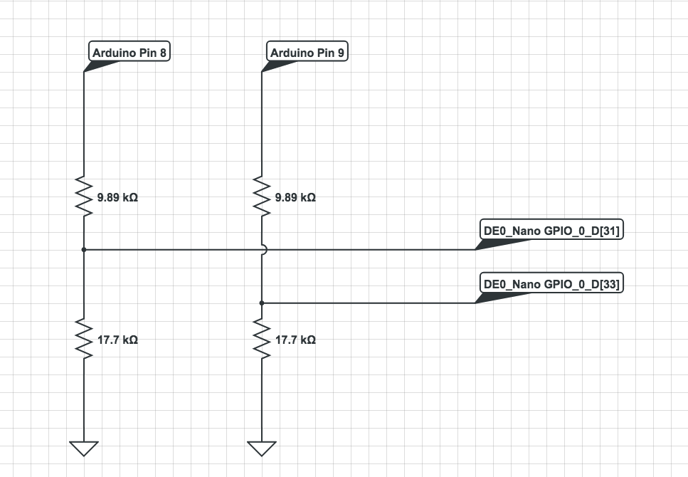
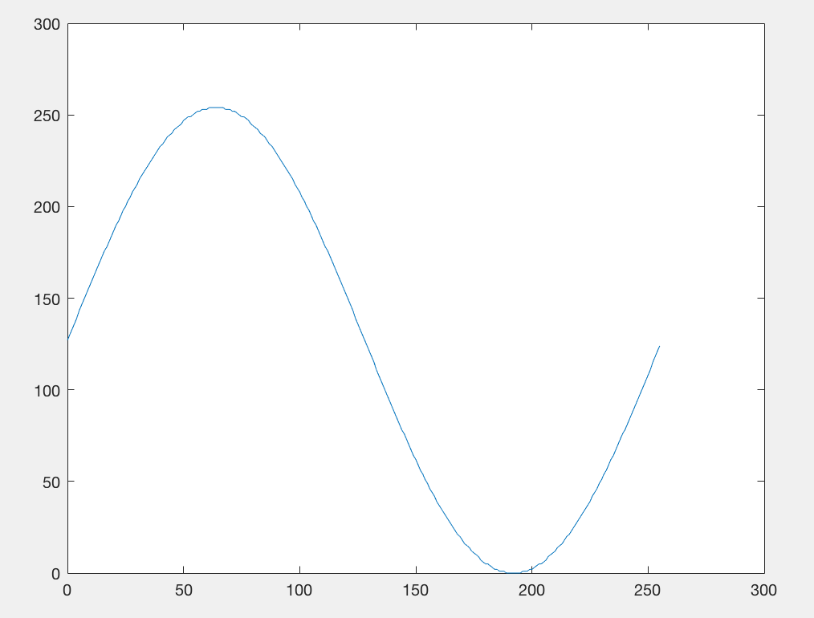
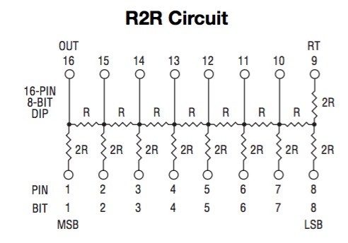

[Home](./homepage.md) 

# Lab 3

## Graphics Team
Radhika, Katherine, and Evan

### Introduction

For this component of the lab, we were tasked with demonstrating the functionality of the DE0-nano field programmable gate array (FPGA) in interfacing with a VGA serial monitor. Specifically, we had to write HDL code that would interact with the VGA driver. The VGA driver--which requests a pixel color for each pixel on the screen--handled the direct interfacing with the VGA. The output pins of the FPGA were hooked up to an adapter, to which the VGA cable of the monitor was connected.

#### Materials used:
- Arduino Uno
- DE0-Nano FPGA
- breadboard
- resistors
- VGA cabled
- VGA monitor
- VGA-FPGA adapter
- wires


### FPGA-VGA Interface

The adapter that connects the FPGA output to the VPA cable is a DAC converter. A DAC converter converts a digital input to an analog output. In other words, the FGPA encodes the 3-channel colors as multi-bit digital binary values, and then the adapter converts these multi-bit values into 1 continuous voltage value. In our case, the VGA supports a maximum 1v input for each color channel. Therefore, the voltage value for each channel is computed by converting the 2-3 bit values (with 3.3v for each `HIGH` bit) for each color channel into 1 analog voltage that can be between 0v and 1v. 

Below is a circuit diagram of the DAC:

{:height="150%" width="150%"}

One can solve for the voltage at the `Red` node (`Vred`). Vred = 0.141*R[2] + 0.0684*R[1] + 0.0321*R[0]. Notice that the "weights" for each bit vary by powers of two, with the MSB having twice the weight as the 1st bit, and the 0th (LSB) bit having 1/4 of the weight as a MSB. In order words, the converter is adding up the bits and weighting each one accordingly in order to generate 1 final voltage value. The bins are also weighted such that if all bits (R[2], R[1], and R[0]) are pulled high (3.3v), the voltage at the output can be supported by the monitor (it comes out to ~0.8v).

A similar analysis yields the analog voltage at the `Green` node. 

For the blue node, the voltage `Vblue` comes out to be: Vblue = 0.1456*B[1] + 0.07096*B[0]. Notice that the weight for B[1] is twice that of B[0] in order to ensure that the analog voltage represents the digital value. 

Another way to think about this converter is by noticing that the resistor values for bits that are weighted more strongly are lower (in fact, the resistor values vary by powers of 2 in order to correspond to voltage weightings of powers of 2). The low-impedance connection between significant bits and the output ensures that this bit will have more influence over the voltage at the output node than bits that are seperated by large resistors. 

The color (red, green, blue) intensity for any given pixel will be proportional to the analog voltage value for that given color channel. So if all the bits for a given channel are `HIGH`, the analog voltage will be at its highest, and the intensity of that color will be maximized.  


### Part 1: Coloring the entire screen

For the first part of this lab, we simply wanted to write the same color value to each pixel on the display. For this, we needed a simple `assign` statement (i.e. `assign PIXEL_COLOR = 8'd300`). 

### Part 2: Coloring a grid

For the second part of the lab, we wanted to have the FPGA write a colored 2x2 grid to the display. We divided this task into two part: a) mapping the raw pixel coordinates to a quadrant on the 2x2 grid, and b) given a quadrant, output what the color should be. 

In order to compute what quadrant of the 2x2 (or outside the grid) a given pixel location corresponded to, we created a new module called `GRID_SELECTOR`. Essentially, `GRID_SELECTOR` divides the pixel coordinates by 128 in order to calculate the grid location. We achieve this division by using a bitshift. We also made the grid width a power of 2 in order to enable us to use this grid assignment method. We made it so that all pixels which fall outside the grid are given a value of 2 for the grid index. Below is our code for this module:

```
module GRID_SELECTOR(
CLOCK_50,
PIXEL_COORD_X,
PIXEL_COORD_Y,
GRID_X,
GRID_Y);


input CLOCK_50;
input wire [9:0] PIXEL_COORD_X;
input wire [9:0] PIXEL_COORD_Y;
output reg [3:0] GRID_X;
output reg [3:0] GRID_Y;


always @ (*) begin
	GRID_X = PIXEL_COORD_X >>>7;
	GRID_Y = PIXEL_COORD_Y >>>7;
	if (GRID_X>4'd1) begin
		GRID_X = 4'd2;
	end
	if (GRID_Y>4'd1) begin
		GRID_Y = 4'd2;
	end
end

	
endmodule

``` 

Within the main module (`DE0_NANO.v`), we instantiated this module and connected it to all the relevant wires. 

We then created a register memory block that would store all the colors for the grid, with indices corresponding to the `GRID_X` and `GRID_Y` outputs of `GRID_SELECTOR`. Below is the code for the memory array:

```
reg[7:0] grid4[2:0] [2:0];

always @(*) begin
	grid[0][0] = 8'd50;
	grid[1][0] = 8'd100;
	grid[0][1] = 8'd150;
	grid[1][1] = 8'd200;
	grid[2][0] = 8'd0;
	grid[2][1] = 8'd0;
	grid[2][2] = 8'd0;
	grid[0][2] = 8'd0;
	grid[1][2] = 8'd0;
end
``` 

Finally, in order to assign the pixel color value, we perform the following assignment: `assign PIXEL_COLOR = grid[GRID_X][GRID_Y]`.

### Part 3: Rudimentary Arduino-FPGA Interface

For the final component of the graphics portion of the lab, we were tasked with demonstrating that we can use an Arduino to communicate with the FPGA in order to display a certain graphic.  

We wrote an Arduino script that repeatedly counts to 3 in binary, with a 1/2 second delay between each iteration:

```
int delayTime = 500; //ms; 

void setup() {

  pinMode(8, OUTPUT);
  pinMode(9, OUTPUT);
}

void loop() {
  for (int i = 0; i<4; i++){
    if (i==0){
      digitalWrite(9, LOW);
      digitalWrite(8, LOW);
    }
    else if (i==1){
      digitalWrite(9, LOW);
      digitalWrite(8, HIGH);
    }
    else if (i==2){
      digitalWrite(9, HIGH);
      digitalWrite(8, LOW);
    }
    else{
      digitalWrite(9, HIGH);
      digitalWrite(8, HIGH);
    }
    delay(delayTime);
  }

}
```

The 2 bit Arduino output "data" then had to be transmitted to the FPGA. Since the Arduino outputs at 5v and the FPGA handles 3.3v, we implemented a simple voltage divider to pull down the voltage. We've included a circuit schematic:



Notice that the voltage that is inputted to the FPGA is equal to the Arduino output pin voltage multiplied by 17.7/(17.7+9.89) =  0.64. When the Arduino voltage equals 5v (`HIGH`), then the voltage inputted to the FPGA (ports 33 and 31) equals roughly 3.2v, which is a permittable value for the FPGA. 

The goal was to have each distinct binary valued input correspond to a distinct grid to be outputted to the display. The display should, therefore, change grid layouts every 1/2 second. 

We made minor modifications to the code we previously had in order to allow for these changes. 

Firstly, we instatiated 4 new memory arrays, corresponding to the 4 different kinds of grids that would be displayed.

```
reg[7:0] grid1[2:0] [2:0];

always @(*) begin
	 grid1[0][0] = 8'b11111111;
	 grid1[1][0] = 8'd300;
	 grid1[0][1] = 8'd300;
	 grid1[1][1] = 8'd300;
	 grid1[2][0] = 8'd00;
	 grid1[2][1] = 8'd00;
	 grid1[2][2] = 8'd00;
	 grid1[0][2] = 8'd00;
	 grid1[1][2] = 8'd00;
end


reg[7:0] grid2[2:0] [2:0];

always @(*) begin
	 grid2[0][0] = 8'd300;
	 grid2[1][0] = 8'b11111111;
	 grid2[0][1] = 8'd300;
	 grid2[1][1] = 8'd300;
	 grid2[2][0] = 8'd0;
	 grid2[2][1] = 8'd0;
	 grid2[2][2] = 8'd0;
	 grid2[0][2] = 8'd0;
	 grid2[1][2] = 8'd0;
end


reg[7:0] grid3[2:0] [2:0];

always @(*) begin
	 grid3[0][0] = 8'd300;
	 grid3[1][0] = 8'd300;
	 grid3[0][1] = 8'b11111111;
	 grid3[1][1] = 8'd300;
	 grid3[2][0] = 8'd0;
	 grid3[2][1] = 8'd0;
	 grid3[2][2] = 8'd0;
	 grid3[0][2] = 8'd0;
	 grid3[1][2] = 8'd0;
end

reg[7:0] grid4[2:0] [2:0];

always @(*) begin
	 grid4[0][0] = 8'd300;
	 grid4[1][0] = 8'd300;
	 grid4[0][1] = 8'd300;
	 grid4[1][1] = 8'b11111111;
	 grid4[2][0] = 8'd0;
	 grid4[2][1] = 8'd0;
	 grid4[2][2] = 8'd0;
	 grid4[0][2] = 8'd0;
	 grid4[1][2] = 8'd0;
end
```

Next, we added an `always` block that would set the `PIXEL_COLOR` depending on the value of the pins `GPIO_0_D[33]` and `GPIO_0_D[31]` (i.e. the output from the Arduino).

```
always @(*) begin
	if (GPIO_0_D[33]==1'd0 && GPIO_0_D[31] == 1'd0) begin
		PIXEL_COLOR = grid1[GRID_X][GRID_Y];
	end
	if (GPIO_0_D[33]==1'd0 && GPIO_0_D[31] == 1'd1) begin
		PIXEL_COLOR = grid2[GRID_X][GRID_Y];
	end
 	if (GPIO_0_D[33]==1'd1 && GPIO_0_D[31] == 1'd0) begin
		PIXEL_COLOR = grid3[GRID_X][GRID_Y];
	end
	if (GPIO_0_D[33]==1'd1 && GPIO_0_D[31] == 1'd1) begin
		PIXEL_COLOR = grid4[GRID_X][GRID_Y];
	end
end
```


We've included a video demonstration:

<iframe width="560" height="315" src="https://www.youtube.com/embed/bsqfBa_z_XE" frameborder="0" allowfullscreen></iframe>


## Acoustic Team
Michael, TJ, and Frannie

###Introduction

The goal of the Acoustic Team was to generate a short tune from the FPGA to be played over a speaker. This tune will be played when the robot finishes mapping the maze.

####Materials used:

- FPGA DEO-Nano
- 8-bit R2R DAC
- Stereo phone jack socket
- Lab speaker


### Part 1: Generating a square wave

A square wave was the simplest wave to generate, since we only needed to toggle one GPIO output on and off at our desired frequency. In order to generate the correct frequency, we created a clock divider parameter that divides the system clock of 25 MHz by 440 Hz. This provides the number of cycles that the FPGA needs to wait before toggling the GPIO pin. We needed to divide the clock divider by an additional factor of 2, so the pin would toggle both on and off in the desired number of cycles. The following code creates a simple counter that will toggle the GPIO pin once it counts through the number of cycles provided by CLKDIVIDER_440.

#### Square wave generation:
```
//localparam
localparam CLKDIVIDER_440 = 25000000 / 440 / 2;

//sound variables
reg square_440;
assign GPIO_0_D[1] = square_440;
reg [15:0] counter;

always @ (posedge CLOCK_25) begin
	if (counter == 0) begin
		counter <= CLKDIVIDER_440 - 1; //reset the clock
		square_440 <= ~square_440; //toggle the square pulse
	end
	else begin
		counter <= counter - 1;
		square_440 <= square_440;
	end
end
```
Then, we attached the GPIO pin 1 to the oscilliscope and speakers to see and hear the square wave. 

<iframe width="560" height="315" src="https://www.youtube.com/embed/dw-YT_o7A1I" frameborder="0" allowfullscreen></iframe>

### Part 2: Generating a sine wave

To generate a sine wave, we used our square wave code, but made it substantially more complex. First, we needed to have a way to store and read out a sine wave (as opposed to calculating the sine values in real time). We did this by creating a ROM module using a Verilog template. We then ported in a sin table (which we created in MATLAB). On every positive edge of the clock, the module finds the relevant entry in the sin table that corresponds to the inputted address value. 

#### 8-bit sine function with values 0-255


#### Sin ROM Module:
```
module sin_rom
(
	input [7:0] addr,
	input clk, 
	output reg [7:0] q
);

	// Declare the ROM variable
	reg [7:0] sine[255:0];

	initial
	begin
		sine[0]<= 8'd127;
		sine[1]<= 8'd130;
		/// everything in between...
		sine[255]<= 8'd124;
	end

	always @ (posedge clk)
	begin
		q <= sine[addr];
	end

endmodule
```

In main, we connect the module to the registers that we have created. We create a sine wave at a specific frequency using a rudimentary direct digital synthesis (DDS) method. We increment through the sine table everytime a counter decrements to zero. Since we use a 25 MHz clock, we need to go through the sine table 400 times to get an output frequency of 400 Hz. Moreover, the sine table is 256 entries long. Hence, our formula for our counter is Clock frequency/Desired Frequency/Number of entries in the table, or in this particular case, 25,000,000/400/256. 

#### In Main:
```
localparam CLKDIVIDER_A_SIN = 25000000 / 400 / 256; //400 Hz
reg [15:0] counter;


always @ (posedge CLOCK_25) begin
	if (counter == 0) begin
		counter <= CLKDIVIDER_A_SIN - 1;
		if (DAC >= 255) begin
			DAC <= 0;
		end
		else begin
			DAC <=  DAC + 1;
		end
	end
	else begin
		counter <= counter - 1;
	end
end
```

To convert the digital sine wave to an analog signal for the speakers we used a R2R Digital to Analog Converter. 



We connected the 8 bit output register of GPIO pins to pins 1-8 on the DAC. Then, the analog signal from pin 16 of the DAC was connected to our speakers. This produced a perfect sine wave, as one can observe in the below video.

<iframe width="560" height="315" src="https://www.youtube.com/embed/TQKGTA-fIVY" frameborder="0" allowfullscreen></iframe>

### Part 3: Generating Three Tones

To generate the three tone signal, we worked off of our sine production code above. This time, instead of just having one clock divider, we created three (one for each tone we wanted to play). We created a simple FSM to switch between frequencies. The only change we had to make to the code which accesses the ROM was to simply make the counter reset to different values depending on the state. The FSM switches between states once per second, creating a pleasant incrementing of tones. You can hear this in the video below.

Note that this program simply plays the three tones in a loop, starting immediately. It would be fairly simple to hook this up to an one bit input signal from the Arduino (as the VGA team did above).

```
 always @ (posedge CLOCK_25) begin
	  if (reset) begin
			freq_state <= 2'b00;
			freq_counter <= 25'b0;
	  end
	  if (freq_counter == ONE_SEC) begin
			freq_counter <= 25'b0;
			freq_state <= freq_state + 2'b1;
			if (freq_state == 2'b11) begin
				freq_state <= 2'b00;
			end
	  end
	  else begin	
			freq_state <= freq_state;
			freq_counter <= freq_counter + 25'b1;
	  end // always @ (posedge CLOCK_25)
 end


localparam CLKDIVIDER_A_SIN = 25000000 / 400 / 256; //400 Hz
localparam CLKDIVIDER_B_SIN = 25000000 / 800 / 256; //800 Hz
localparam CLKDIVIDER_C_SIN = 25000000 / 600 / 256; //600 Hz
reg [15:0] counter;


always @ (posedge CLOCK_25) begin
	if (counter == 0) begin
		if (freq_state == 0) begin
			counter <= CLKDIVIDER_A_SIN - 1;
		end
		if (freq_state == 1) begin
			counter <= CLKDIVIDER_B_SIN - 1;
		end
		if (freq_state == 2) begin
			counter <= CLKDIVIDER_C_SIN - 1;
		end
		if (DAC >= 255) begin
			DAC <= 0;
		end
		else begin
			DAC <=  DAC + 1;
		end
	end
	else begin
		counter <= counter - 1;
	end
end

```

<iframe width="560" height="315" src="https://www.youtube.com/embed/FSzmDpvT8Bo" frameborder="0" allowfullscreen></iframe>
